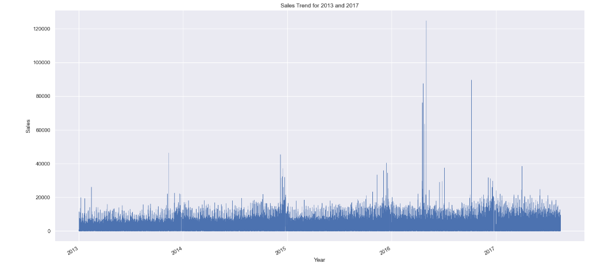
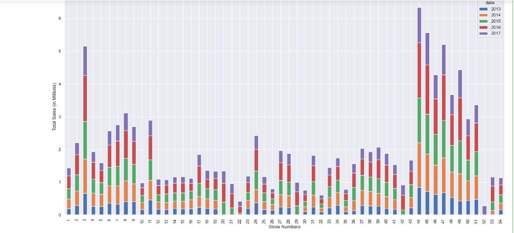
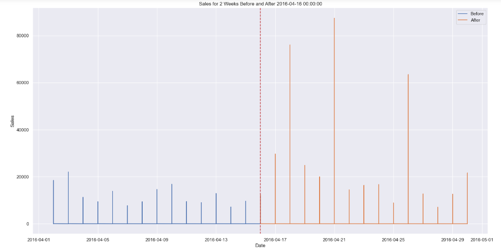
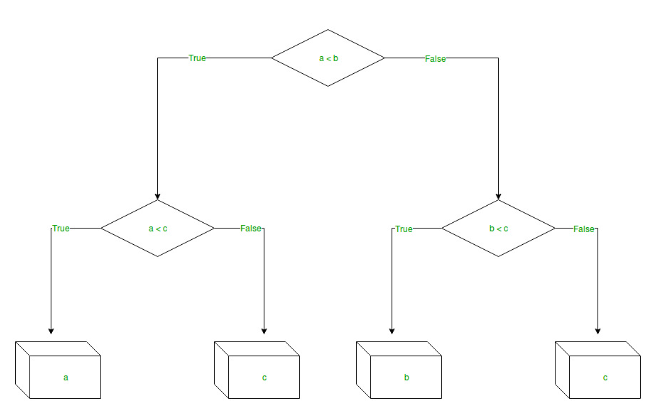
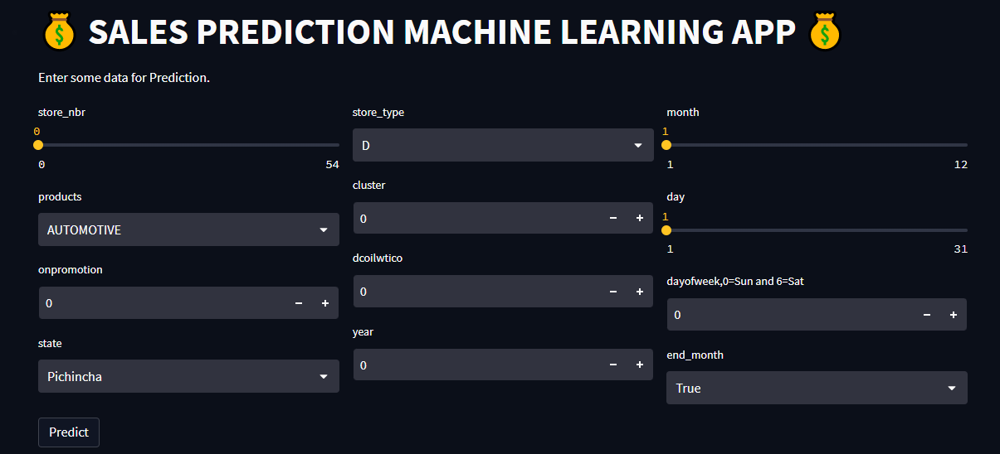

# Store-sales-prediction:Machine-Learning and Streamlit App.
This project aims to predict store sales using machine learning techniques. The project includes exploratory data analysis (EDA), model training, and deployment using Streamlit.

## Table of Contents
[Introduction](Introduction)\
[Datasets](Datasets)\
[EDA](EDA)\
[Model](Model)\
[Deployment-Streamlit](Deployment-Streamlit)\
[Set-up](Set-up)\
[Usage](Usage)\
[Summary](Summary)\
[Contribution](Contribution)\
[Contact](Contact)
## Introduction

This is a time-series forecasting project.In this project we'll train a model that accurately predicts the sales of items in different stores. We'll use store sales data from large Ecuadorian-based grocery retailer.

Specifically, build a model that more accurately predicts the unit sales for thousands of items sold at different Favorita stores.

The training data includes dates, store, and product information, whether that item was being promoted, as well as the sales numbers.

## Dataset Description
The project data includes several CSV files:

1.`train.csv`: Contains the training data, including time series of features such as store_nbr, family, onpromotion, and the target sales.\
2.`test.csv`: Provides the test data with the same features as the training data, where the goal is to predict the target sales for the given dates.\
3.`transaction.csv`: Includes date, store_nbr, and transaction information for specific dates.\
4.`sample_submission.csv`: A sample submission file in the correct format.\
5.`stores.csv`: Store metadata, including city, state, type, and cluster information for grouping similar stores.\
6.`oil.csv`: Daily oil price data that spans the train and test data timeframes. Oil prices can impact Ecuador's economy and, consequently, supermarket sales.\
7.`holidays_events`.csv: Holidays and events data with additional metadata.\

Additional Notes
Wages in the public sector are paid every two weeks on the 15th and on the last day of the month. Supermarket sales could be affected by this.\
A magnitude 7.8 earthquake struck Ecuador on April 16, 2016. People rallied in relief efforts donating water and other first need products which greatly affected supermarket sales for several weeks after the earthquake.

## Exploratory Data Analysis
The EDA phase involves understanding and exploring the dataset to gain insights and prepare it for model training. It includes tasks such as data cleaning, feature engineering, visualization, and statistical analysis. In this project, we have performed comprehensive EDA to understand the patterns, relationships, and distributions within the sales dataset.
The sales trend over the years\


The annual sales that each store make.From the plot we realise that some stores were opened later in the years than other stores making them having lessser sales.\


After the earthquake we realise that there was apositive impact to the sales for the several weeks after.



## Decision Tree Regression Model
The model training phase is where we develop a machine learning model using the prepared dataset.The model is trained on the historical sales data to learn the patterns and make predictions.

Decision tree is a supervised learning algorithm. It observes features of an object and trains a model in the structure of a tree to predict data in the future to produce meaningful continuous output.


The decision tree model captures an rmle of 1.86.

## Deployment-Streamlit APP.
To provide an interactive and user-friendly interface, we have deployed the Store Sales Prediction model using Streamlit. Streamlit allows us to create and share custom web applications for machine learning projects. Users can input the required data and get instant predictions for store sales.

## Set-up
for windows: 
1.Create the Python's virtual environment that isolates the required libraries of the project to avoid conflicts\
```bash
python -m venv venv
```
2.Activate the Python's virtual environment so that the Python kernel & libraries will be those of the isolated environment;\
```bash
venv\Scripts\activate
```
3.To install the required dependencies, use the following command:
```bash
pip install -r requirements.txt
```

## Usage
To run the Streamlit application locally, execute the following command:
```bash
streamlit run app.py
```

## Summary
| Code      | Name        | Published Article |  Deployed App |
|-----------|-------------|:-------------:|------:|
| LP4 | Store sales prediction app | [My Medium Article](https://medium.com/@peninarandu/store-sales-prediction-streamlit-app-46a94fdd0a8f)| [My app](https://huggingface.co/spaces/Pendo/Store_sales_prediction_app) |

## Contributions
Contributions and pull requests are welcome! If you would like to contribute to this project, please follow these steps:

1.Fork this repository.\
2.Create a new branch with a descriptive name\
3.Make your desired changes and commit them.\
4.Push the branch to your forked repository.\
5.Open a pull request in this repository and describe your changes.

Feel free to contribute to different aspects of the project, including improving the model, exploring additional features, or enhancing the EDA.
## Author 
Penina Pendo.


